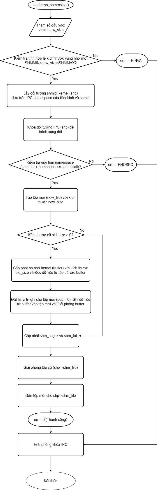

# shmresize
## Mô tả chức năng hàm
Viết hàm ksys_shmresize() vào trong source code của cơ chế Shared Memory, hàm này có tác dụng là mở rộng hoặc giảm phân đoạn shared memory segment mà không làm mất dữ liệu cũ trước đó và shmid của phân đoạn shared memory segment không thay đổi để tránh ảnh hưởng tới việc attach/dettach của các tiến trình khác cùng giao tiếp.
## [Hướng dẫn build kernel](build_kernel.md)
## Lưu đồ thuật toán

